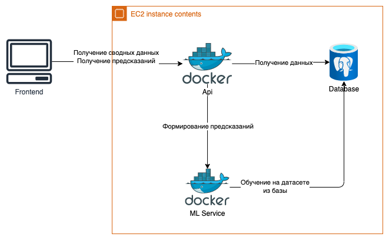

### Ссылки
Исходный код: https://github.com/TeaDove/marketing-hack-misis-anime/ <br>
Интерфейс: http://marking-frontend.website.yandexcloud.net/#/pred/link <br>
Презентация: https://docs.google.com/presentation/d/1y2-SBC7W-DmQEKa-umuO1jCIrrTnMXOk/edit?usp=sharing&ouid=109487284558704250484&rtpof=true&sd=true <br>

### Концепция
Построение графа знания для производителя и предсказание появлений новых связей

### Описание алгоритмов(Решение)
В ходе решения поставленной задачи создания удобного инструментария для участников товарооборота с участием Честного Знака мы представили данные как некий Граф Знаний, на основе которого уже обучили свёрточную модель ComplEx. Таким образом, мы получили общую модель знаний, которую можно применять на широком пласте задач, связанных с работой производителей и дистрибьюторов.

Применение:
Модель и API к ней имеют 2 метода:
- `GET /predictions/link` - принимает на вход HEAD_INN и TAIL_INN, возвращает множество пар <Тип связи, Вероятность связи>. По данному методу можно получить вероятность того, что 2 inn(будь то поставщик, товарная точка, производитель) будут иметь связь. Связи могут быть: "distributes_from_to", distributes", distributed_to", located_in", "sold_in", "sales"
- `GET /predictions/relations` - принимает на вход INN и Relation, возвращает множество пар <INN, Вероятность связи>. Данный метод позволяет по корневой ноде найти для указанных связей вероятные ноды. 

#### Применение
Данный граф позволяет "предсказывать" появление новых связий, таким образом "подсказывая" производетелю какие действия могут благосклонно повлиять на бизнес. Например, производитель может найти нового дистрибьютора. 
Так как производитель может владеть дистрибьютором или торговой точкой, он также может оптимизировать процесс дистрибьюции или, например, закупки товаров. 

### Питч
Тезисы:
- Мы построили граф знаний 
- По данному графу можно "предсказать" появление новых связей (линков)
- Указанные связи можно интерпретировать для разных целей, например, поиск новых дистрибьтюторов

### Команда
МИСИС анимешники!
Состав:
- Петер Ибрагимов, капитан команды, бекенд-девопс разработчик
- Артём Соседка, дата аналитик
- Евгений Четвертков, фронтенд разработчик
- Яна Рыхлицкая, UI-UX дизайнер.
- Всеволод Карвецкий, бекенд разработчик

### Архитектура решения
Решение делалось с использованием:
- Postgres - база данных
- FastAPI - веб сервер
- React - фронтенд
- Dicee - графовая нейросеть 


### Доступ
Фронтенд сайт доступен по http://84.252.136.195 <br>
Swagger доступен по http://84.252.136.195:8000/docs <br>

### Запуск
```
pip install pandas

make download-data # скачивание данных
make preprocess-data # препроцессинг данных

docker-compose up -d 
```


